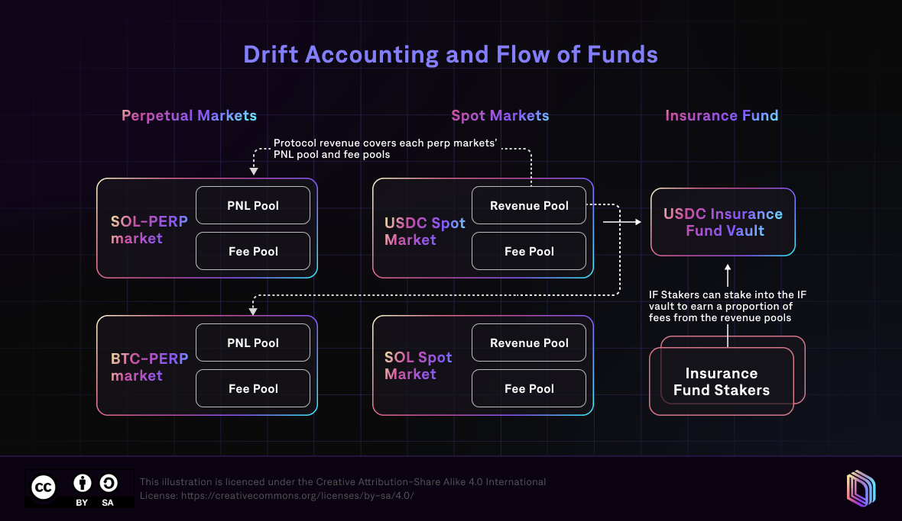

Within Drift Protocol, all token deposits are held in a global collateral vault. This is required for seamless cross-margin and borrow-lend. The only exception to this is the insurance fund vault residing outside.

Ensuring proper accounting across users requires a robust settlement mechanism. The protocol uses intermediate Pool Balances to facilitate transfers and ensure that claimed gains are required to come from settled offsetting losses.

### Perpetual Market

An individual perpetual market has two pools:

&#x20; A. P\&L Pool: to accumulate funds from users with losses for settlement to users with profits
&#x20; B. Fee Pool: to accumulate a fraction of exchange fees for the Quote Spot Market's Revenue Pool

The P\&L Pool receives the highest priority on claimed funds, in order to give user's the best possible experience. The default fraction of exchange fees for the Fee Pool is `total_exchange_fee / 2` and this fraction is determined by: `SHARE_OF_FEES_ALLOCATED_TO_CLEARING_HOUSE`.

:::hint{type="info"}
The Fee Pool will only get partially filled up by up to 1% of intermediate P\&L settled from a user's losses and aggressively drawn down for the benefit of the P\&L Pool otherwise.
:::

### Spot Market

An individual spot market has two pools:

&#x20; A. Revenue Pool: to accumulate revenue across the protocol, denominated in this token
&#x20; B. Fee Pool: to pay fillers and settle portions to the revenue pool

The Revenue Pool can collect fees from:

-   Borrow interest

-   Liquidations

-   Perpetual Markets

and can pay out to

-   Insurance Fund Stakers

-   Perpetual Markets

(see details of these rules in [Revenue Pool](<../Drift Protocol v2 Docs/Revenue Pool.md>))

The Fee Pool collects exchange fees from swaps and uses them to pay out the Keeper Network [Keepers & Decentralised Orderbook](<../Drift Protocol v2 Docs/Keepers _ Decentralised Orderbook.md>)

### Future Work

Currently, a Perpetuals Market can only pull from the Spot Market Revenue Pool and Insurance Fund for its quote currency.

-   In the future, it may be possible for a distressed associative perp market (BTC-PERP) to be able to pull funds from the associated spot market (BTC) revenue/insurance pool and immediately swap for USDC to top off its fee/P\&L pool.&#x20;
