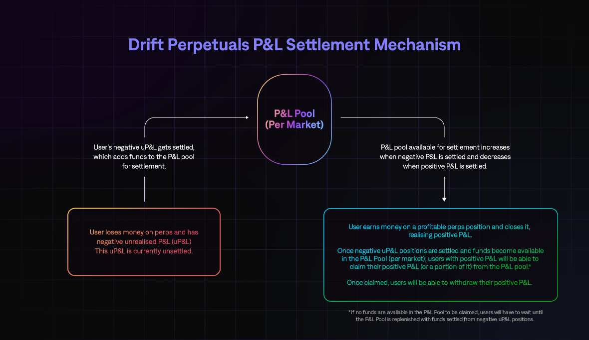

Any account can call the `settlePNL` instruction, which will trigger negative P\&L accounts to be settled, adding to each per-market P\&L pool. Negative P\&L being settled increases the amount available to be settled, whilst positive P\&L being settled decreases the amount available for settlement.

**_Note_**: calling `settlePNL` does not affect open positions. The function only settles the funds available in the PNL Pool for withdrawal.&#x20;

It's important to recognise the difference between **settling P\&L** and **realising P\&L **(read more here: [P\&L](<../Drift Protocol v2 Docs/P_L.md>).&#x20;

### Calling `settlePNL`

Any account can call `settlePNL` instruction. Once called, all unrealised negative P\&L will be settled and added to the market's P\&L Pool to be made available for withdrawal.&#x20;

Users with open positions that have negative unrealised P\&L will have their unrealised P\&L settled and sent to the P\&L Pool; **however, their position will be unaffected**.

As users are settled against, the Cost Basis for their position will be adjusted so that their position remains unchanged even though a portion of their unrealised negative P\&L has been realised and sent to the P\&L Pool.

The P\&L settled as a result of the `settlePNL` instruction will be reflected in the`Unrealised P&L` tab, specifically within the`Realised P&L` column. The adjusted cost basis for the position is reflected in the `Cost Basis` column.&#x20;

